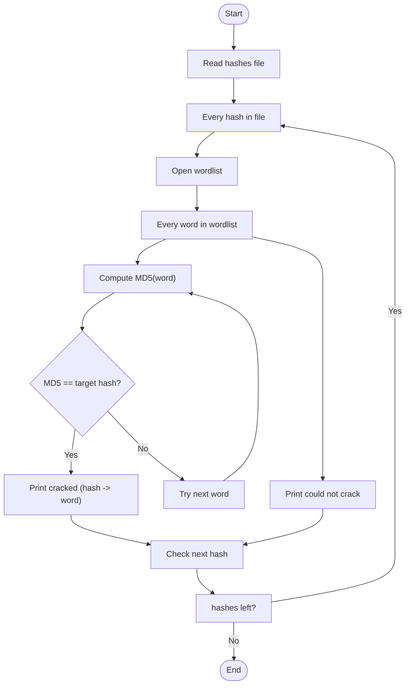

# Jane-the-Ripper

- reads a file of MD5 hashes
- tries each word from a provided wordlist
- computes the MD5 of each word and compares it to each target hash
- prints cracked results and reports any hashes it couldn't crack

### Usage

Run the script and provide the paths when prompted:

```bash
python3 jane-the-ripper.py
```

Expected output examples:

- `✅ Cracked: <md5hash> -> password` for matches
- `❌ Could not crack: <md5hash>` when no match found

### How it works (flowchart)

